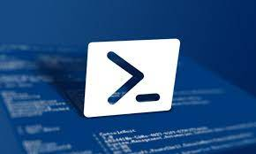

# PowerShell
Fitxa amb alguns cmdLets bàsics i els seus usos més habituals.

# ÍNDEX

## GENERAL
1.  [BREU INTRODUCCIÓ.](md/introduccio.md)
2.  [GESTIÓ DE FITXERS I CARPETES][FITXERS]
3.  [GESTIÓ D'USUARIS I GRUPS (LOCALS)][COMPTES LOCALS]
4.  [COMPARTICIÓ DE RECURSOS][RECURSOS]
5.  [GESTIÓ DE PROCESOS][PROCESOS]
6.  [GESTIÓ D'EVENTS][EVENTS]
7.  [GESTIÓ DE XARXA][XARXA]
8.  [INFORMACIÓ DEL HARDWARE][HARDWARE]

## ACTIVE DIRECTORY
9.  [USUARIS DE L'ACTIVE DIRECTORY][USUARIS AD]
10. [GRUPS DE L'ACTIVE DIRECTORY][GRUPS AD]
11. [UNITATS ORGANITZATIVES][UNITATS ORGANITZATIVES]

ANNEXES

11. [INSTAL·LACIÓ DEL POWERSHELL EN UN UBUNTU][POWERSHELL EN UBUNTU]
12. PRÀCTICA ACTIVE DIRECTORY

[INTRODUCCIÓ]:https://github.com/tofermos/PowerShell/blob/main/introduccio.md
[FITXERS]:https://github.com/tofermos/PowerShell/blob/main/POWERSHELL%20GESTIO%20DE%20FITXERS%20I%20CARPETES.md
[COMPTES LOCALS]:https://github.com/tofermos/PowerShell/blob/main/GESTIO%20USUARIS.md
[RECURSOS]:https://github.com/tofermos/PowerShell/blob/main/COMPARTIR%20RECURSOS.md
[PROCESOS]:https://github.com/tofermos/PowerShell/blob/main/PROCESSOS.md
[EVENTS]:https://github.com/tofermos/PowerShell/blob/main/GESTI%C3%93%20D'EVENTS.md
[XARXA]:https://github.com/tofermos/PowerShell/blob/main/POWERSHELL-XARXES.md
[HARDWARE]:https://github.com/tofermos/PowerShell/blob/main/WMI-CIM.md
[USUARIS AD]:https://github.com/tofermos/PowerShell/blob/main/ADUser.md
[GRUPS AD]:https://github.com/tofermos/PowerShell/blob/main/ADGroup.md
[UNITATS ORGANITZATIVES]:https://github.com/tofermos/PowerShell/blob/main/ADunitatsOrganitzatives.md
[POWERSHELL EN UBUNTU]:https://github.com/tofermos/PowerShell/blob/main/INSTAL·LAR%20POWERSHELL%20EN%20UBUNTU.md
[POWERSEHLL EN UBUNTU]:https://github.com/tofermos/PowerShell/blob/main/INSTAL%C2%B7LAR%20POWERSHELL%20EN%20UBUNTU.md

