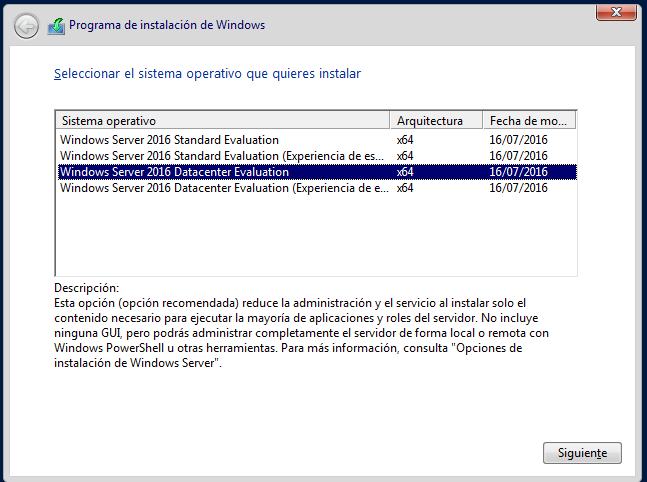
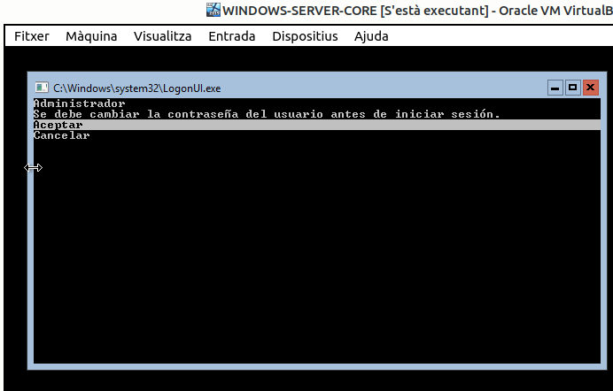
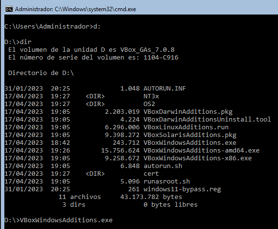
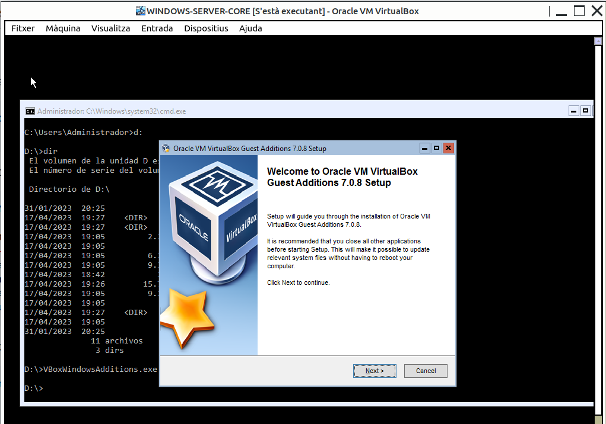
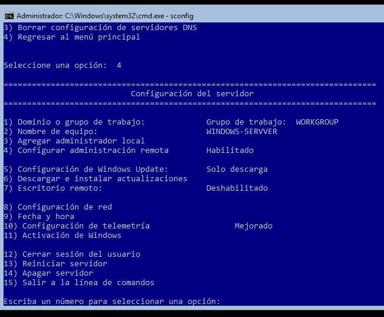
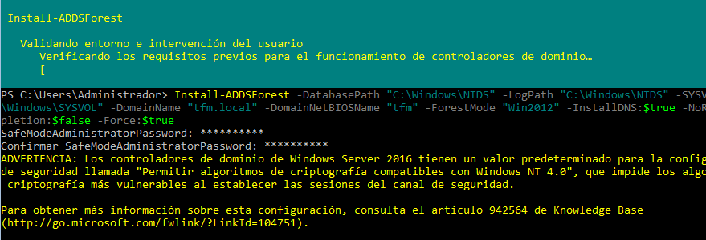
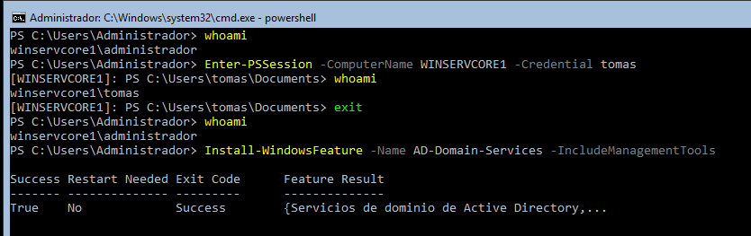

# INSTAL·LACIÓ DEL WINDOWS SERVER CORE.

Hem de triar l'opció que no duu "experiencia escritorio"





En **VirtualBox** instal·lem el GuestAdditions. Insertant a ISO al CD i excutant l'exe.







## SCONFIG. CONFIGURACIÓ INICIAL.

Encara amb els cmdLets de PowerShell es poden fer totes les tasques de confifguració inicial, disposem d'una utilitat específica interactiva més pràctica: **sconfig**



### Configuració de la NIC


### Configuració d'actualitzacions automàtiques


### Habilitar Escriptori remot


## INSTAL·LACIÓ DE L'ACTIVE DIRECTORY.





Per començar a fer algunes accions, ara ja carreguem el PowerShell

```cmd
PowerShell
```

Comprovem que el domini s'ha creat correctament.

```powershell
get-ADdomain
```

```powershell
(get-addomain).DNSRoot
```

```powershell
(get-addomain).name
```

Amb el *get-ADdomain* veiem tota la informació del domini, nom, nom net bios, contenidor de computadors...


