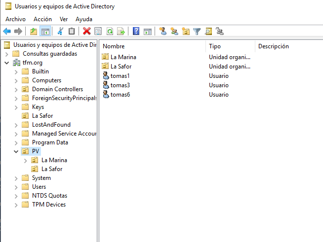

🗃️ [INDEX POWERSHELL][POWERSHELL]
# PREPARACIÓ DE L'EXEMPLE

## 1. Crear les Unitats Organitzatives.
Per a la pràctica necessitem una estructura del domini ( tfm.org ) amb les Unitats Organitzatives que veus a la imatge.

* La Safor en la rel del domini DC=tfm,DC=org
* PV en DC=tfm,DC=org
* La Safor en DC=PV,DC=tfm,DC=org
* La Marina en DC=PV,DC=tfm,DC=org



### 1.0 Obtenim els cmdLets necessaris i l'ajuda
Prenem nota de quins són els cmd
```powershell
get-command *ADorg*
```
```code

CommandType     Name                                               Version    Source                                                             
-----------     ----                                               -------    ------                                                             
Cmdlet          Get-ADOrganizationalUnit                           1.0.1.0    ActiveDirectory                                                    
Cmdlet          New-ADOrganizationalUnit                           1.0.1.0    ActiveDirectory                                                    
Cmdlet          Remove-ADOrganizationalUnit                        1.0.1.0    ActiveDirectory                                                    
Cmdlet          Set-ADOrganizationalUnit                           1.0.1.0    ActiveDirectory 
```
Exemple...
``` powershell
Get help Get-ADOrganizationalUnit -examples
```


### 1.1 Creació d'UO
Creem les dos primeresUOs que pengen de la rel...
```powershell
New-ADOrganizationalUnit -Name "La Safor"
```
```powershell
New-ADOrganizationalUnit -Name "PV"
```
### 1.2 Llegim les UO
Comprovem el resultat...
```powershell
Get-ADOrganizationalUnit -Filter *
```
El resultat són totes les UO...
```code
City                     : 
Country                  : 
DistinguishedName        : OU=Domain Controllers,DC=tfm,DC=org
LinkedGroupPolicyObjects : {CN={6AC1786C-016F-11D2-945F-00C04fB984F9},CN=Policies,CN=System,DC=tfm,DC=org}
ManagedBy                : 
Name                     : Domain Controllers
ObjectClass              : organizationalUnit
ObjectGUID               : e50ad61d-2224-4466-8581-9011536edca7
PostalCode               : 
State                    : 
StreetAddress            : 

City                     : 
Country                  : 
DistinguishedName        : OU=La Safor,DC=tfm,DC=org
LinkedGroupPolicyObjects : {}
ManagedBy                : 
Name                     : La Safor
ObjectClass              : organizationalUnit
ObjectGUID               : 1256510b-2038-4bad-8cfb-6ee84fb97c9f
PostalCode               : 
State                    : 
StreetAddress            : 

City                     : 
Country                  : 
DistinguishedName        : OU=PV,DC=tfm,DC=org
LinkedGroupPolicyObjects : {}
ManagedBy                : 
Name                     : PV
ObjectClass              : organizationalUnit
ObjectGUID               : 04e6a00d-7e26-40fb-a7bd-940fe69590fc
PostalCode               : 
State                    : 
StreetAddress            : 
```
### 1.3 Filtrar al cmdLet tipus "GET" un sol objecte...

```powershell
Get-ADOrganizationalUnit -Identity "OU=La Safor,DC=tfm,DC=org"
```

>:memo: **Apunt 1: Filtrar un sol objecte en un cmdLet "GET"**
>Quan tenim un cmdLet tipus GET que ens retorna més d'un objecte (UOs en el nostre cas) i volem seleccionar-ne un només, tenim dos alternatives:
>
>1. Filtrar amb el paràmetre *-filter* indicant una propietat amb valor únic (Distinguishedname, ObjectGUID...)
>3. Usar el camp -Identity amb una propietat amb valor únic.
>
>#### Paràmetre *-filter*
>```powershell
>Get-ADOrganizationalUnit -filter "DistinguishedName -like 'La Safor'"
>```
>```powershell
>Get-ADOrganizationalUnit -Filter "ObjectGUID -eq '1256510b-2038-4bad-8cfb-6ee84fb97c9f'"
>```
>#### Paràmetre *-identity*
>```powershell
>Get-ADOrganizationalUnit -Identity 1256510b-2038-4bad-8cfb-6ee84fb97c9f
>```
>```powershell
>Get-ADOrganizationalUnit -Identity "OU=La Safor,DC=tfm,DC=org"
>```
### 1.4 Ubicació dels objectes i paràmetre *-path*

Hem vist que, per defecte, la ubicació de les UO és a la rel del domini. Amb el paràmetre *-path* podem indicar una altra.

Usem el cmdLet que ens dona el domini
```powershell
Get-ADDomain
```

>:memo: **Apunt 2: Formats d'eixida dels cmdLet**
>Observa que el format per defecte del cmdLet tipus "get" és el Format List ( |fl )
>```powershell
>Get-ADDomain | fl
>```
>Pots canviar-lo a Format-Table
>```powershell
>Get-ADDomain | ft
>```
>O el Format Extés indicant la propietat a seleccionar
>```powershell
>Get-ADDomain |fw -Property ComputersContainer
>```
>El cmdLet "select-object" també serveix per seleccionar una propietat, a banda de filtar un objecte concret...
>```powershell
>Get-ADOrganizationalUnit -Filter "name -like 'la safor'"|Select-Object -Property distinguishedname
>```
>

🔎 El que interessa és llegir el valor de la propietat, sense línies en blanc, ni espais, ni ratlles...
Podem accedir a mètodes i propietats del objectes ( Powershell es basa en OOD )
```powershell
(Get-ADDomain).distinguishedname
```

Recordem que no pot haver-hi dos objectes amb el mateix nom en la mateixa ubicació ( de forma anàloga al que passa amb els fitxers en l'arbre de directoris )

💻 **Comproveu-ho que no pot haver dos UO amb el mateix nom a la mateixa ubicació...**
```powershell
New-ADOrganizationalUnit -Name "La safor" -Path (get-ADdomain).distinguishedname
```

###  1.5 Canvi de propietats

🔎 En el cas de les UO un canvi important és de la **"protecció contra eliminació accidental"**.

```powershell
Set-ADOrganizationalUnit -Identity "OU=la safor,DC=tfm,DC=org" -ProtectedFromAccidentalDeletion 0
```
o també
```powershell
Set-ADOrganizationalUnit -Identity "OU=la safor,DC=tfm,DC=org" -ProtectedFromAccidentalDeletion $false
```
Ara ja ens permet fer canvis com l'eliminació o moure la UO.

💻 **Proveu canviar altres propietats**

### 1.6 Eliminar UO.

Partim d'una UO que, en crear-la, ja l'hem protegida contra eliminacions accidentals.
```powershell
PS C:\Users\Administrador> New-ADOrganizationalUnit -name "LA RIBERA" -ProtectedFromAccidentalDeletion $tr
```
Intentem eliminar-la i comporvem que no tenim permís...
```powershell
PS C:\Users\Administrador> Remove-ADOrganizationalUnit -Identity "OU=La ribera,DC=tfm,DC=org" -Confirm:$true

Remove-ADOrganizationalUnit : Acceso denegado

En línea: 1 Carácter: 1
+ Remove-ADOrganizationalUnit -Identity "OU=La ribera,DC=tfm,DC=org"
+ ~~~~~~~~~~~~~~~~~~~~~~~~~~~~~~~~~~~~~~~~~~~~~~~~~~~~~~~~~~~~~~~~~~
    + CategoryInfo          : PermissionDenied: (OU=La ribera,DC=tfm,DC=org:ADOrganizationalUnit) [Remove-ADOrganizationalUnit], UnauthorizedAcc 
   essException
    + FullyQualifiedErrorId : ActiveDirectoryCmdlet:System.UnauthorizedAccessException,Microsoft.ActiveDirectory.Management.Commands.RemoveADOrg 
   anizationalUnit
 ```
Desprotegim la UO contra eliminats accidentals i provem...
```powershell
PS C:\Users\Administrador> Set-ADOrganizationalUnit -Identity "OU=la ribera,DC=tfm,DC=org" -ProtectedFromAccidentalDeletion 0

PS C:\Users\Administrador> remove-ADOrganizationalUnit -Identity "OU=la ribera,DC=tfm,DC=org" -Confirm:$true 
```

### 1.6 Movem l'objecte
Per a canviar d'ubicació una UO, també cal desactivar la protecció contra eliminacions accidentals prèviament

```powershell
Move-ADObject "OU=La Safor,DC=tfm,DC=org" -targetpath "OU=PV,DC=tfm,DC=org"
```

:computer: **Acabeu de crear les Unitats Organitzatives indicades a la imatge per continuar l'activitat.**
* Podeu indicar la ubicació amb el paràmetre *-path* de *new-adOrganizationalUnit* en crear-les o
* crear-les a la rel i després moure-les amb el *move-object*
