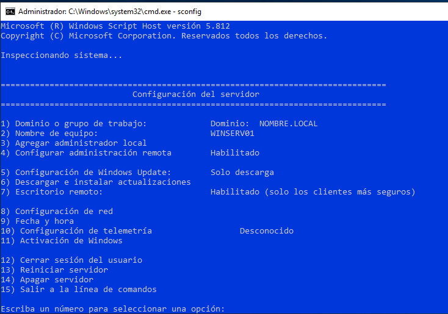

# INSTAL·LACIÓ I CONFIGURACIÓ BÀSICA D'*ACTIVE DIRECTORY* DES DE POWERSHELL

##  Instal·lació de Active Directory
Les eines d'administrador no venen per defecte.Per això afegim el *-IncludeManagementTools*

```powershell
Install-windowsfeature -name AD-Domain-Services -IncludeManagementTools
```
Per disposar de les eines per instal·lar i configurar el domini
```powershell
Import-module addsdeployment
```
```powershell
Install-ADDSForest -DatabasePath "C:\Windows\NTDS" -LogPath "C:\Windows\NTDS" -SYSVOLPath "C:\Windows\SYSVOL" 
-DomainName "tfm.local" -DomainNetBIOSName "tfm" -ForestMode "Win2012" -InstallDNS:$true -NoRebootOnCompletion:$false -Force:$true
```
Ens demana reinciar per aplicar la nova configuració...Quan acabe ens deman iniciar sessió. Tornem a executar el PowerShell.

```PowerShell
Get-DnsServerSetting
```

## CONFIGURACIÓ DELS SERVIDOR

```powershell
sconfig
```
</img>


